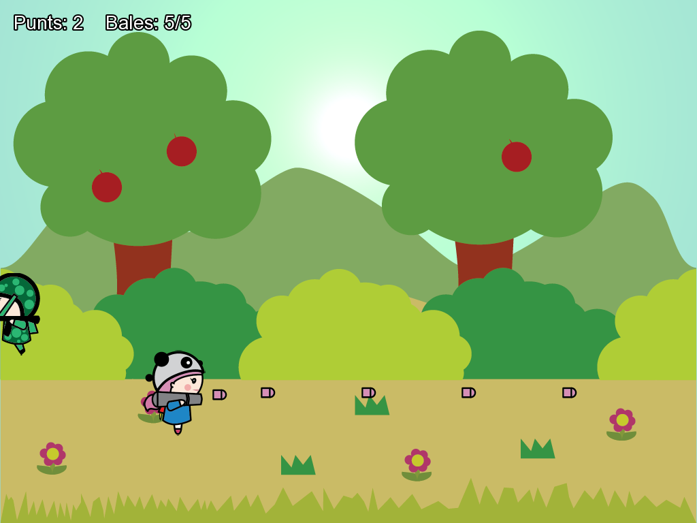
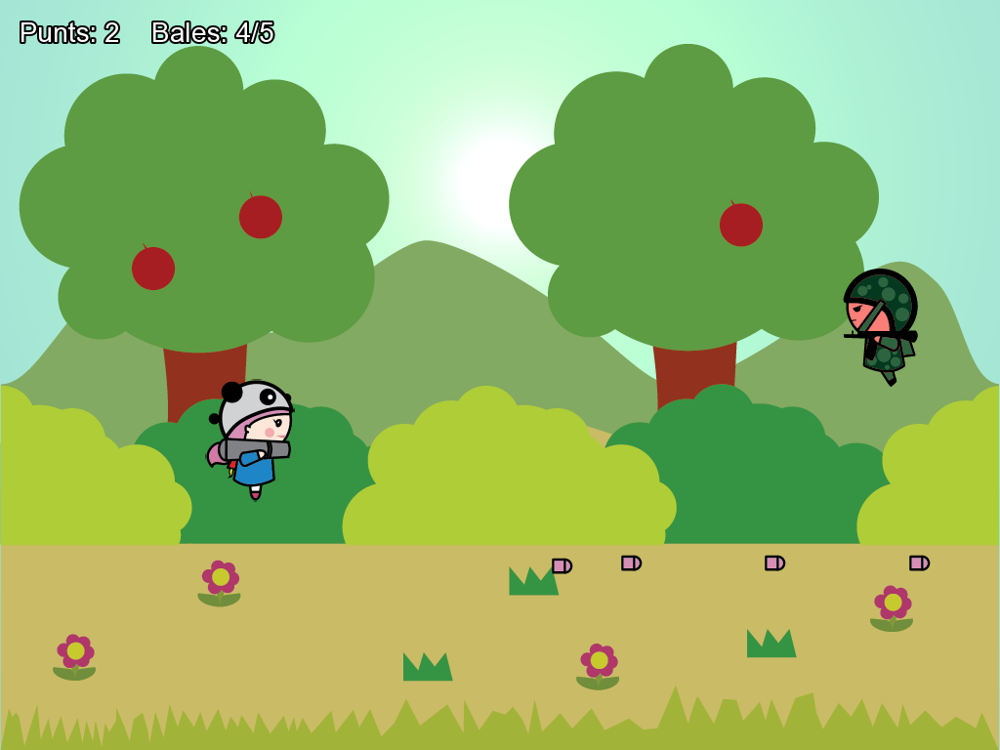

# Motor — TinyBazooka (C++ / SFML 3)

Juego 2D de acción lateral hecho en clase (C042 · Programació de videojocs 2D i 3D, La Salle Girona).
El héroe salta con doble salto, dispara cohetes con la flecha abajo y los enemigos que toca una bala desaparecen y suman un punto.

## Controles

| Tecla | Acción |
|---|---|
| ↑ | Saltar (doble salto) |
| ↓ | Disparar (máximo 5 balas a la vez) |
| Esc | Salir |

## Estructura

| Fichero | Qué hace |
|---|---|
| `Game.h/.cpp` | Motor del juego: bucle `run()` (entrada → `actualitzar(dt)` → `dibuixar()`), balas, enemigos, colisiones, marcador y sonido |
| `Heroi.h/.cpp` | Héroe: gravedad, doble salto y animación por spritesheet |
| `Bala.h/.cpp` | Proyectil: se mueve recto a la derecha y se borra al salir de pantalla o al tocar un enemigo |
| `Enemic.h/.cpp` | Clase base abstracta de los enemigos |
| `EnemicTerrestre.h/.cpp` | Enemigo que corre en línea recta por el suelo |
| `EnemicAeri.h/.cpp` | Enemigo que vuela haciendo una onda (seno) |
| `GestorTextures.h` | Patrón Singleton: carga cada textura una sola vez |
| `Config.h` | Todas las constantes del juego |
| `Assets/` | Imágenes, fuentes y sonidos |

## Cómo compilar

1. Instala **SFML 3** (Visual C++ 17 2022, 64 bits) en `C:\SFML64`. Si lo tienes en otra carpeta, cambia la ruta en Propiedades › C/C++ › General y Vinculador › General.
2. Abre `PDGV_motor.sln` con **Visual Studio 2022**.
3. Selecciona la configuración **Debug** o **Release** y la plataforma **x64** (las configuraciones Win32 no tienen SFML configurado).
4. Pulsa **F5**. Las DLL de SFML y la carpeta `Assets` ya están junto al proyecto.

## Detalles técnicos

- Todo el movimiento se multiplica por `dt`, así el juego va igual a cualquier FPS.
- Las balas y los enemigos se guardan en `std::vector<T*>`; `Game` hace el `new` y también el `delete` (al salir de pantalla, al chocar y en el destructor).
- Colisiones por cajas englobantes (AABB) con `getGlobalBounds().findIntersection()`.
- Sonido con `sf::SoundBuffer` + `sf::Sound` (`fire.ogg` al disparar, `hit.ogg` al impactar).

